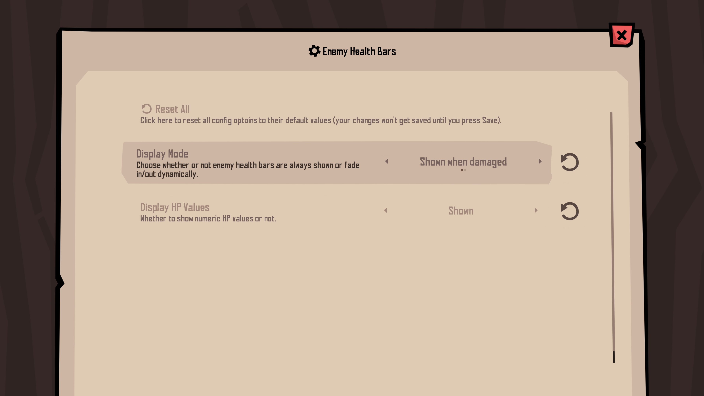

# Mod Menu

Mod manager UI for Rotwood, adds a "Mods" page to the game's options screen to manage/configure mods.

**Pre Bonechill Quarry branch**: From the Bonechill Quarry beta onwards, the options screen UI was updated and is no longer compatible with Mod Menu 1.2 or below, I'll still keep this old version on a separate branch if you need to use Mod Menu with older game versions, but I won't be actively maintaining this version anymore.

